# MisTask
First MIS task on Github.
##Azure原型部分
主页 打开之后看到 总共有哪些设备
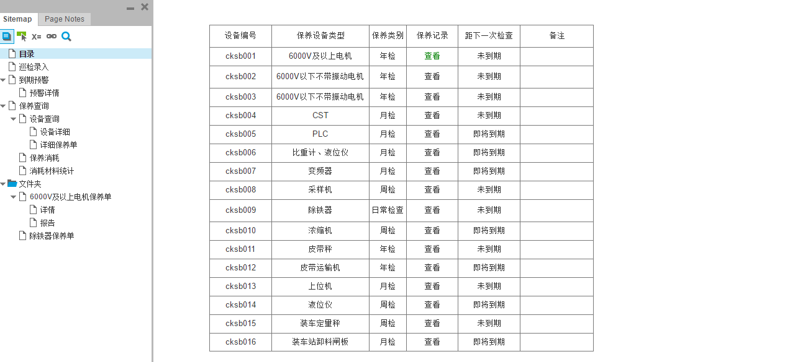
巡检录入，填写表格
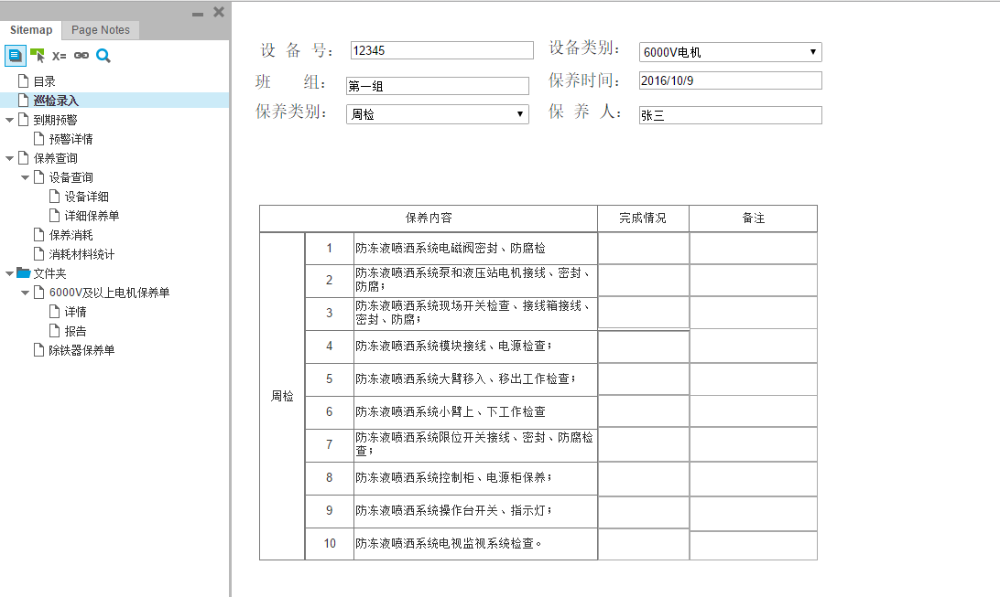
输入到期预警的时间，点击查询
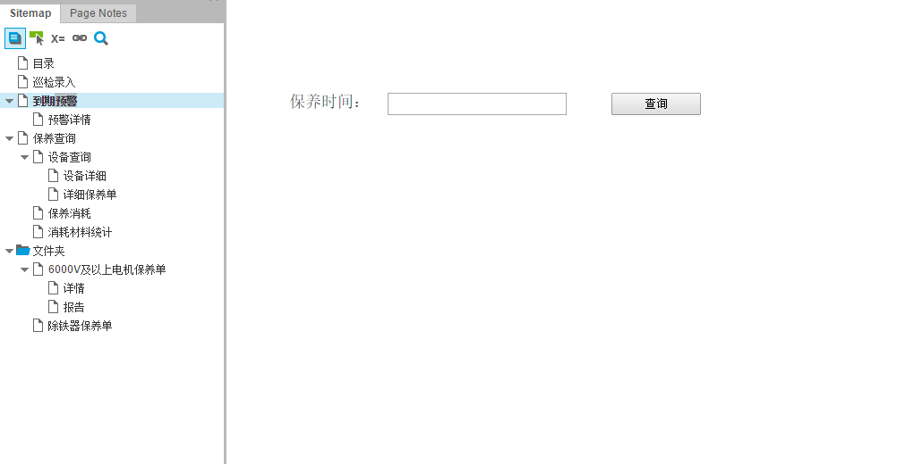
 显示出具体临近预警期的设备
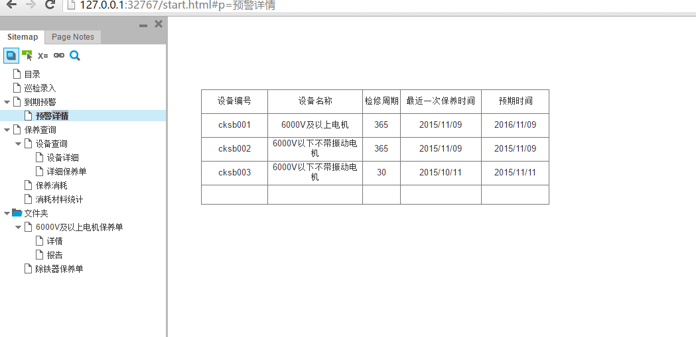
 填写设备编号
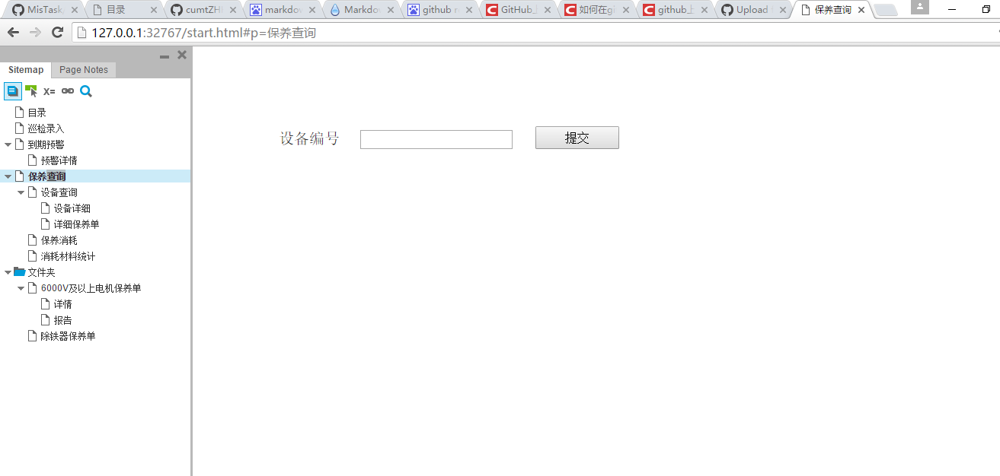
填写设备号
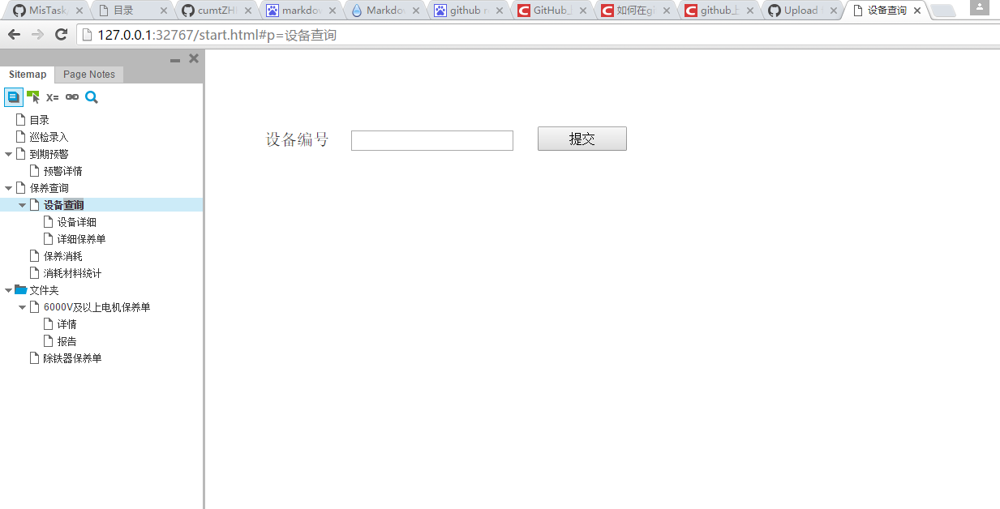
看到设备的详情 点击是，跳转确定；点击否，查看详细的设备保养单
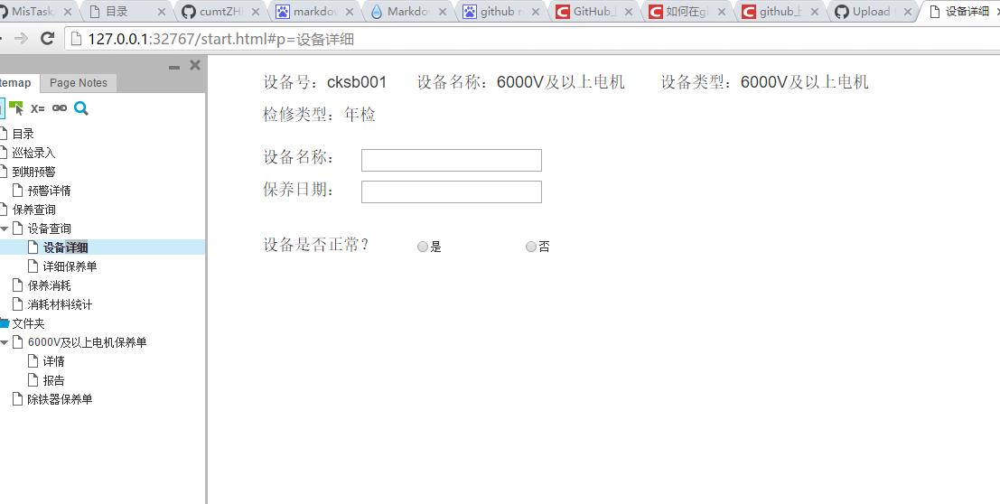
点击添加，添加需要消耗的材料
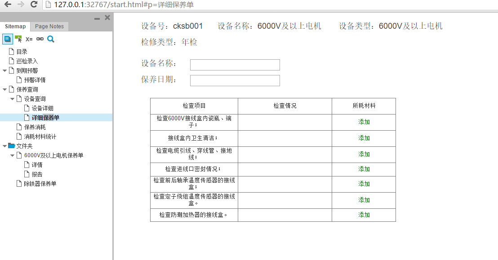
选择消耗的材料和数量，点击继续继续填写；点击完成，显示下面消耗材料的统计
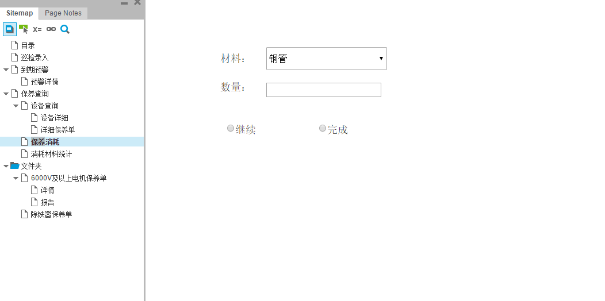
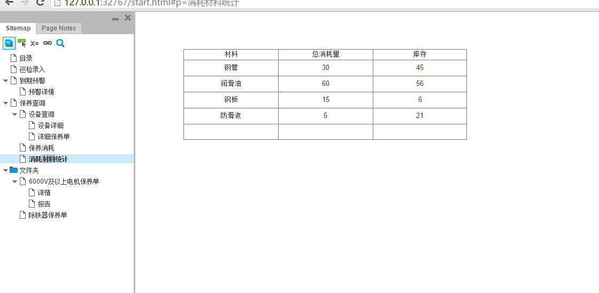
看到异常具体情况，点击返回， 返回上一层；点击生成报告，生成此设备详细的检修记录单
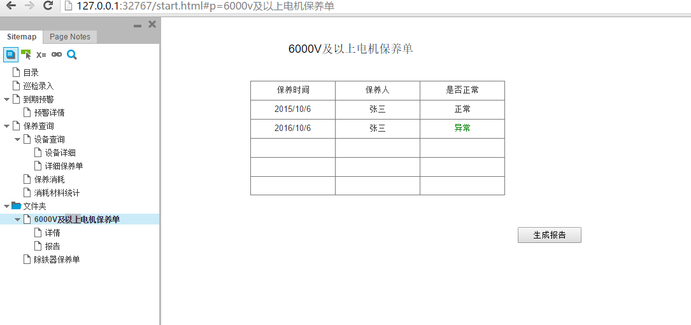
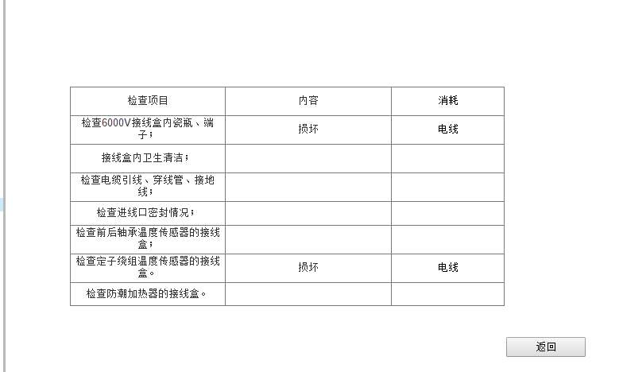
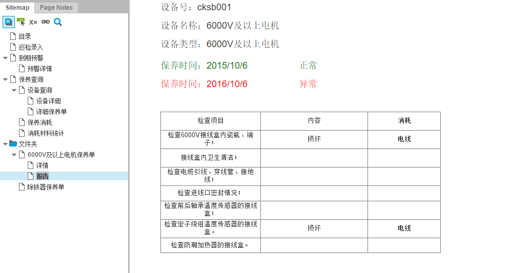

##PowerDesigner截图

